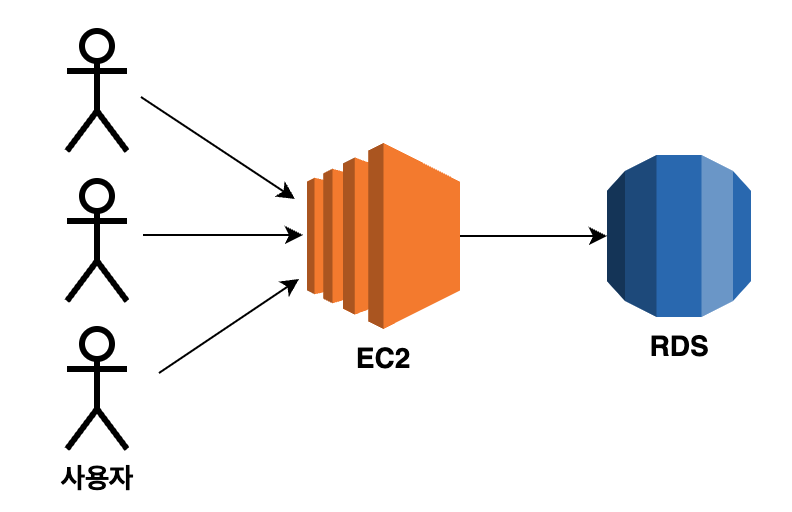
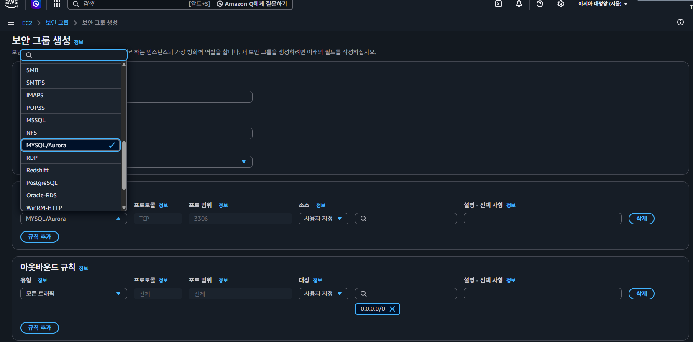
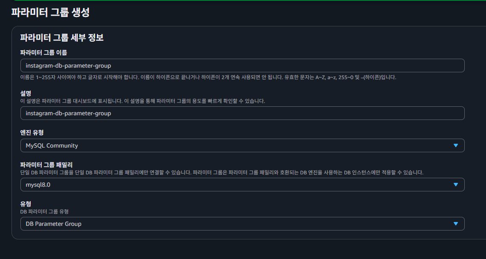
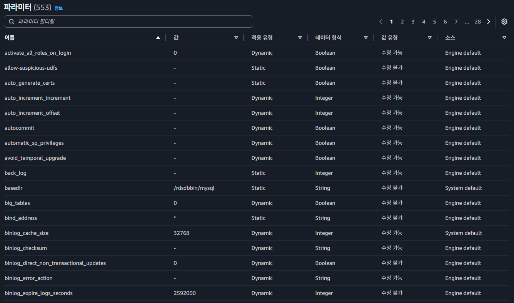

# RDS + EC2 연동 배포

---

## 1. 복습 — 지금까지의 배포 흐름

```
EC2 인스턴스 생성
  → Java 설치
  → Spring Boot 프로젝트 clone
  → Nginx 설치
  → Certbot 설치
탄력적 IP 발급
  → EC2 인스턴스와 연결
도메인 발급
  → 서브 도메인과 탄력적 IP 연결
```

### 각 단계별 접속 방식

| 단계 | 접속 방식 |
|------|----------|
| clone까지만 완료 | `http://퍼블릭IP` 로 접속 |
| 탄력적 IP 발급 | 재시작해도 동일한 IP로 접속 가능 |
| 도메인 발급 | 문자열 주소로 접속 가능 |
| Nginx + Certbot 적용 | `https://` 로 접속 가능 |

---

## 2. RDS란?

### Relational Database Service

AWS 상에서 **관계형 데이터베이스를 빌려서 사용할 수 있는 서비스.**

- 내부에 MySQL / MariaDB / PostgreSQL 등 다양한 DB를 제공
- 사용자가 원하는 유형을 선택해서 사용 가능
- 백업 / 업데이트 / 자동 확장 기능 기본 제공

### RDS 인스턴스

AWS로부터 빌린 DB가 설치되어 있는 컴퓨터 한 대. EC2 인스턴스와 동일한 개념.

### RDS 설정 옵션

| 옵션 | 설명 |
|------|------|
| 엔진 유형 | DB 종류. MySQL, MariaDB, Amazon Aurora 등 |
| 인스턴스 클래스 | 컴퓨터 성능. EC2의 인스턴스 유형과 유사한 개념 |
| 스토리지 | 저장 공간. EC2와 용어 동일 |

---

## 3. RDS를 사용하는 이유

**다른 방법들과 비교**

| 방법 | 가능 여부 | 비고 |
|------|----------|------|
| 백엔드는 EC2, DB는 로컬 | 가능 | 개발 환경에서만 사용 |
| EC2에 백엔드 + DB 함께 | 가능 | 토이 프로젝트 수준. 실무 비권장 |
| EC2 + RDS 분리 | 권장 | 실무 표준 |

> **EC2에 백엔드 + DB를 함께 두면 안 되는 이유**:  
> 백엔드 서버에 장애가 발생하면 EC2 인스턴스 자체에 이상이 생기므로 DB도 함께 영향을 받을 수 있다.  
> 서버와 DB를 분리해야 각각 독립적으로 관리 가능하다.

---

## 4. RDS 적용 아키텍처



---

## 5. RDS 인스턴스 생성

- Public access → **YES** 설정 (개발 환경 / 로컬에서 RDS 접근 가능하도록)
- 나머지는 Free Tier로 설정
- 마스터 ID 및 패스워드 설정

---

## 6. RDS 보안 그룹 설정



- EC2 → 보안 그룹 생성으로 진입
- 생성 이후 해당 보안 그룹을 DB 기본 보안 그룹으로 설정

---

## 7. RDS 파라미터 그룹 세팅




한글 및 이모지 데이터를 올바르게 처리하기 위해 문자셋을 설정한다.

**1. 이하 속성들을 `utf8mb4`로 변경**

- `character_set_client`
- `character_set_connection`
- `character_set_database`
- `character_set_filesystem`
- `character_set_results`
- `character_set_server`

**2. 이하 속성들을 `utf8mb4_unicode_ci`로 변경**

> `utf8mb4_unicode_ci`: 정렬 / 비교 방식을 명시하는 속성

- `collation_connection`
- `collation_server`

**3. `time_zone` 속성을 `Asia/Seoul`로 변경**

> **주의**: 파라미터 그룹 변경 후 반드시 **RDS 재부팅**해야 정상 적용된다.

---

## 8. RDS 로컬 접속 (DBeaver)

DBeaver 설치 확인 후 MySQL로 연결.

- Server Name: RDS 인스턴스 엔드포인트
- Username: 마스터 ID
- Password: 마스터 패스워드

### Public Key 오류 해결

```
오류: Public key retrieval is not allowed
```

**해결 방법**:
1. DBeaver Database Navigator에서 해당 연결 우클릭
2. 편집(Edit Connection) 선택
3. Driver properties 탭으로 이동
4. `allowPublicKeyRetrieval` 값을 `false` → **`true`** 로 변경

---

## 9. EC2와 RDS 연결 — application.yml 설정

EC2 인스턴스 생성 후 Java 설치 및 프로젝트 clone 완료 후  
`src/main/resources/application.yml` 파일을 아래와 같이 작성한다.

```yml
server:
  port: 8080
spring:
  datasource:
    url: jdbc:mysql://RDS엔드포인트:3306/instagram
    username: admin
    password: 비밀번호
    driver-class-name: com.mysql.cj.jdbc.Driver
  jpa:
    hibernate:
      ddl-auto: update
    show-sql: true
```

> `:wq`로 저장 후 종료.

---

## 10. 빌드 및 실행

```bash
# 루트 프로젝트로 이동
cd ../../../

# 실행 권한 부여 후 빌드
chmod +x gradlew
./gradlew clean build

# build/libs로 이동
cd build/libs
```

### 실행 방식 비교

```bash
# ❌ 터미널 종료 시 서버도 종료됨
sudo java -jar aws-rds-springboot-0.0.1-SNAPSHOT.jar

# ✅ 터미널 종료 후에도 백그라운드에서 계속 실행
sudo nohup java -jar rds-ec2-springboot-0.0.1-SNAPSHOT.jar
```

### nohup이란?

`No Hang Up`의 축약어.  
터미널 세션이 종료되어도 프로세스가 계속 실행되도록 한다.

---

## 11. nohup 사용 시 포트 점유 문제 해결

`nohup`으로 실행한 서버를 다시 빌드 후 재실행하려고 하면  
기존 프로세스가 포트를 점유하고 있어 실행이 안될 수 있다.

```bash
# 1. 8080 포트를 점유하고 있는 프로세스 확인 → PID 확인
sudo lsof -i:8080

# 2. 해당 프로세스 종료
sudo kill {PID 값}

# 3. 빌드 후 nohup으로 재실행
sudo nohup java -jar rds-ec2-springboot-0.0.1-SNAPSHOT.jar

# 4. 정상 실행 확인 — 신규 PID가 8080 포트 점유 중이면 새 버전이 실행된 것
sudo lsof -i:8080
```

---

## 12. 안전 삭제 순서

> EC2 - RDS 간 연결은 `application.yml` 설정으로만 이루어지므로  
> AWS 콘솔에서 별도 연결 해제 작업은 필요 없다.

```
1. RDS 삭제
   └─ 자동 백업 관련 체크박스 해제 필수 (체크 시 삭제 후에도 비용 발생)
2. RDS 보안 그룹 삭제
3. RDS 파라미터 그룹 삭제
4. EC2 탄력적 IP Release
5. EC2 인스턴스 종료
```

> **주의**: RDS 삭제 시 자동 백업 옵션을 체크하면  
> RDS를 삭제한 이후에도 스냅샷 비용이 계속 청구될 수 있다.

---

## 13. 내일 수업 예고

```
1. EC2 생성 → Spring Boot 프로젝트 clone
2. RDS 생성 → DBeaver로 로컬 DBMS와 AWS RDS 간의 연결 형성
3. Spring Boot 프로젝트와 RDS 연결
4. 탄력적 IP 발급 후 프로젝트와 연결
5. 도메인 발급 후 탄력적 IP와 연결
6. EC2 내부에 Nginx, Certbot 설치
7. HTTPS 설정
```

---

## 14. 자주 발생하는 오류 & 실수 모음

### RDS 설정 관련

**파라미터 그룹 변경 후 재부팅 누락**
```
# 파라미터 그룹 변경 후 RDS를 재부팅하지 않으면 변경사항이 적용되지 않는다.
# 반드시 RDS 콘솔에서 재부팅 후 확인할 것.
```

**Public Access 설정 누락**
```
# ❌ Public Access가 NO면 로컬/DBeaver에서 RDS 접속 불가
# ✅ 개발 환경에서는 Public Access를 YES로 설정
```

**RDS 삭제 시 자동 백업 체크**
```
# ❌ 자동 백업 옵션 체크 후 삭제 → 스냅샷 비용 계속 발생
# ✅ 자동 백업 체크박스 반드시 해제 후 삭제
```

---

### DBeaver 연결 관련

**allowPublicKeyRetrieval 미설정**
```
오류: Public key retrieval is not allowed

해결: Driver properties → allowPublicKeyRetrieval → true로 변경
```

**엔드포인트 오입력**
```
# ❌ 탄력적 IP 주소 입력
# ✅ RDS 인스턴스의 엔드포인트 주소 입력
#    (형식: xxxx.rds.amazonaws.com)
```

---

### nohup 관련

**포트 점유 상태에서 재실행 시도**
```bash
# ❌ 기존 프로세스 종료 없이 재실행 → 포트 충돌 오류
sudo nohup java -jar rds-ec2-springboot-0.0.1-SNAPSHOT.jar

# ✅ 기존 프로세스 확인 후 종료 → 재실행
sudo lsof -i:8080
sudo kill {PID}
sudo nohup java -jar rds-ec2-springboot-0.0.1-SNAPSHOT.jar
```

---

### application.yml 관련

**RDS 엔드포인트 포트 누락**
```yml
# ❌ 포트 번호 없으면 연결 실패
url: jdbc:mysql://엔드포인트/instagram

# ✅ 포트 번호 명시
url: jdbc:mysql://엔드포인트:3306/instagram
```

**드라이버 클래스 오입력**
```yml
# ❌ MariaDB 드라이버 (RDS MySQL 사용 시)
driver-class-name: org.mariadb.jdbc.Driver

# ✅ MySQL 드라이버
driver-class-name: com.mysql.cj.jdbc.Driver
```

---

## 오늘 학습 요약

1. **RDS** — AWS 관계형 DB 서비스. EC2와 분리하여 독립적으로 관리
2. **파라미터 그룹** — `utf8mb4` 문자셋, `Asia/Seoul` 타임존 설정. 변경 후 재부팅 필수
3. **DBeaver 연결** — RDS 엔드포인트 + 마스터 ID/PW. `allowPublicKeyRetrieval=true` 설정
4. **application.yml** — RDS 엔드포인트 + 포트(3306) + DB명 + MySQL 드라이버 설정
5. **nohup** — 터미널 종료 후에도 서버 유지. 재실행 시 포트 점유 프로세스 종료 필수
6. **안전 삭제 순서** — RDS(자동백업 해제) → 보안그룹 → 파라미터그룹 → EC2